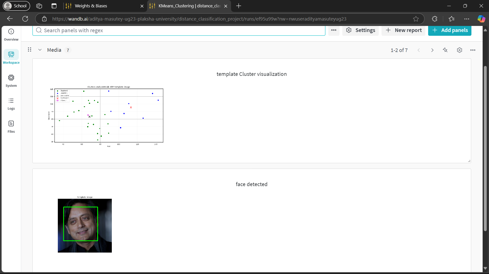
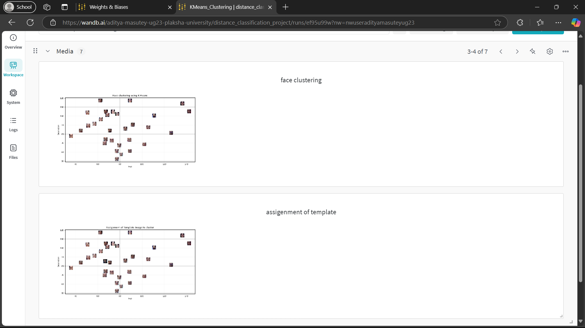
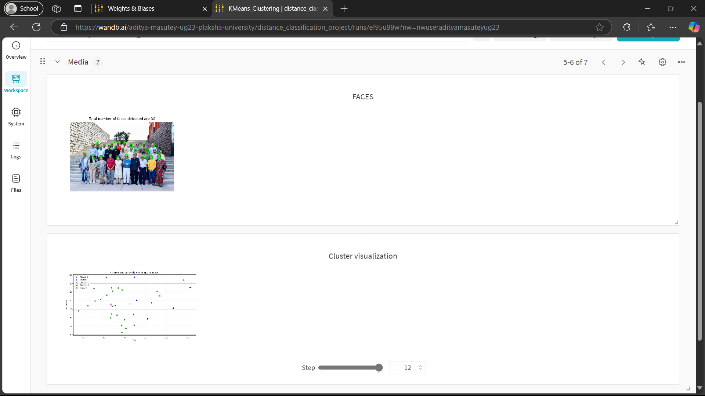
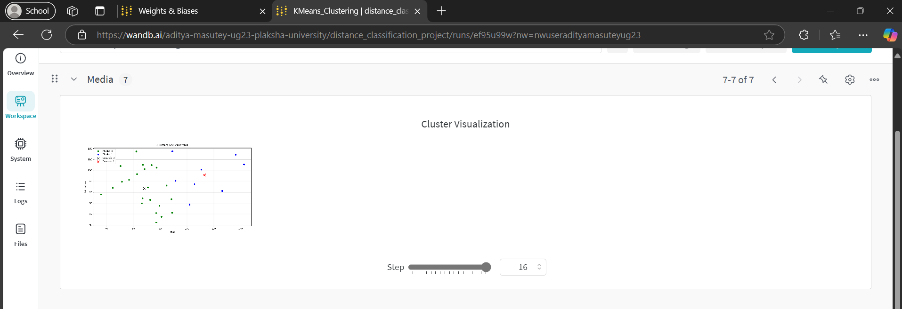

## REPORT

### 1. What are the common distance metrics used in distance-based classification algorithms?

1. **Euclidean Distance**: Represents the shortest distance between two vectors.
2. **Manhattan Distance**: Measures the distance between two points by adding up the absolute differences of their coordinates.
3. **Mahalanobis Distance**: Represents the distance between a point P and a distribution D by measuring how many standard deviations away P is from the mean of D.

### 2. What are some real-world applications of distance-based classification algorithms?

- Anomaly and Fraud Detection  
- Face Recognition  
- Malware Categorization  
- Disease Classification  

### 3. Explain various distance metrics.

1. **Chebyshev Distance**: Also known as Chessboard distance, because in Chess it equals the minimum number of moves needed by a king to go from one square to another.
2. **Minkowski Distance**: A generalized distance metric which can be modified by substituting the value of ‘p’ to calculate the distance between two points:
   - If `p = 1`, Manhattan Distance (L1 norm)
   - If `p = 2`, Euclidean Distance (L2 norm)
   - If `p = ∞`, Chebyshev Distance (L∞ norm)
3. **Cosine Distance**: Measures the degree of angle between two vectors (often used for word frequency comparisons in documents). It is used when the magnitude does not matter, but their orientation does.

### 4. What is the role of cross-validation in model performance?

- Prevents overfitting by testing on different subsets of data.  
- **K-fold cross-validation**: Splits data into `k` parts, trains on `k-1` parts, tests on the remaining, and repeats `k` times.  
- Improves reliability by averaging performance across multiple splits.  
- Reduces bias & variance compared to a single train-test split.  
- Essential for model selection and hyperparameter tuning.  

### 5. Explain variance and bias in terms of KNN.

- **Bias**: The error due to overly simplistic assumptions in the model.  
  - **Small k**: Low bias (follows training data closely).  
  - **Large k**: High bias (overly smooth decision boundary).  

- **Variance**: The error due to excessive sensitivity to training data.  
  - **Small k**: High variance (sensitive to noise).  
  - **Large k**: Low variance (more stable but may underfit).

## SCREENSHOTS

